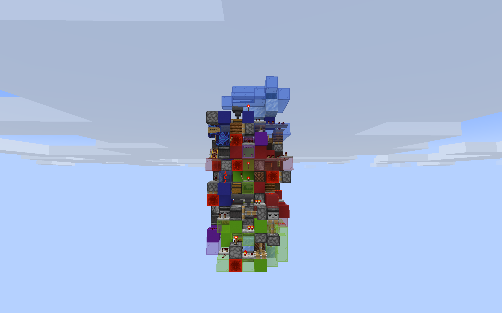

# AKminer2's Scarpet Scripts
This is a collection of scarpet apps made by me to be used for Minecraft purposes.

# Installation Instructions
1. In Minecraft, assuming you have carpet installed, run
```/carpet scriptAppStore AKminer2/scarpet/contents/programs```
2. Next, run
```/script download <app>.sc```
to download any of my scarpet apps you wish.

# Scarpet Apps Included
## samecolor
A scarpet app to change all of the colored blocks in a specified area to be the same color. This is intended to be used for redstone designing.

For example:
